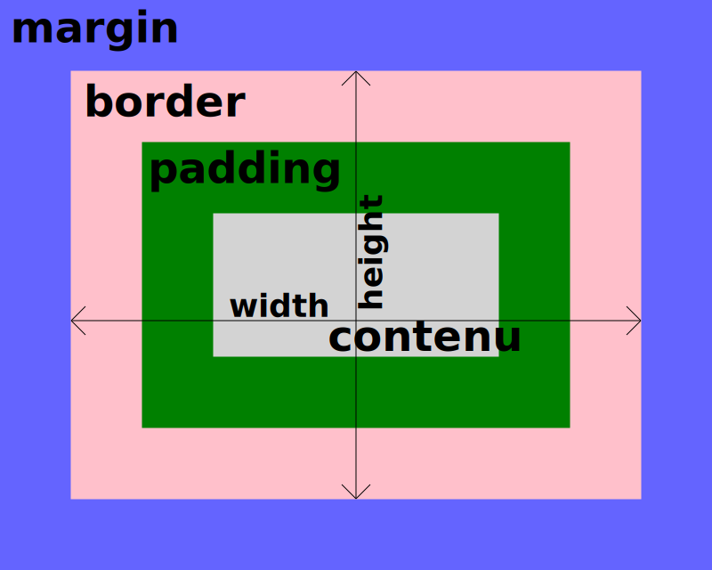

# Formation CSS

Ce dépôt contient les ressources pour apprendre le langage CSS de zéro. Pour cette formation, vous devez avoir des connaissances de base en HTML disponibles [ici](https://github.com/romainbourdain/formation-html).

## Objectifs du CSS

Là où le HTML servait à structurer le contenu d'une page web, le CSS sert à mettre en forme ce contenu. Il permet de définir la couleur, la taille, la police de caractères, la position des éléments, etc.

Il existe trois façons de faire du style CSS :

### Directement dans les balises HTML ❌

```html
<h1 style="color: blue; font-size: 24px; font-family: Arial;">Titre</h1>
```

### En utilisant les balises style ❌

```html
<style>
    h1 {
        color: blue;
        font-size: 24px;
        font-family: Arial;
    }
</style>
```

### En utilisant un fichier CSS externe ✅

```html
<link rel="stylesheet" href="style.css">
```

## Importer un fichier CSS

Pour importer un fichier CSS externe, il suffit d'ajouter une balise `link` dans le `head` de votre fichier HTML.

```html
<!DOCTYPE html>
<html lang="fr">
<head>
    <meta charset="UTF-8">
    <title>Titre de la page</title>
    <link rel="stylesheet" href="style.css">
</head>
<body>
    <h1>Titre</h1>
</body>
</html>
```

Vous pouvez maintenant créer un fichier `style.css` à la racine de votre projet et y ajouter vos styles.

```css
h1 {
    color: blue;
    font-size: 24px;
    font-family: Arial;
}
```

> [!TIP]
> Testez systématiquement si le fichier CSS a bien été importé en changeant la couleur du texte par exemple. Cela peut vous éviter de perdre du temps à chercher une erreur qui n'existe pas.

## Sélecteurs

Le CSS est un language utilisant des **sélecteurs** et des **propriétés**. Les **sélecteurs** permettent de cibler un ou plusieurs éléments HTML, et les propriétés de définir le style de ces éléments.

Il existe plusieurs types de sélecteurs :

- Les sélecteurs de balises : `h1`, `p`, `div`, etc.
- Les sélecteurs de classe : `.ma-classe`
- Les sélecteurs d'identifiant : `#mon-id`
- Les sélecteurs de pseudo-éléments : `::before`, `::after`
- Les sélecteurs de pseudo-classes : `:hover`, `:active`, `:focus`, etc.

Ainsi, si vous voulez appliquer un style à tous les boutons de votre site, vous pouvez utiliser le sélecteur de balise `button`.

```css
button {
    /* Propriétés CSS */
}
```

Si jamais vous voulez appliquer un style à un seul bouton, vous pouvez utiliser un sélecteur d'identifiant.

```html
<!-- index.html -->
<button id="mon-bouton">Cliquez ici</button>
```

```css
/* style.css */
#mon-bouton {
    /* Propriétés CSS */
}
```

> [!WARNING]
> Vous ne pouvez affecter un identifiant qu'à un seul élément HTML. Si vous avez besoin d'affecter un style à plusieurs éléments, utilisez une classe.

### Combinaison de sélecteurs

Il est possible de combiner plusieurs sélecteurs pour cibler des éléments plus précisément.

#### Sélection de plusieurs éléments

```css
h1, h2, h3 {
    /* Propriétés CSS */
}
```

Le style est ici appliqué à tous les titres `h1`, `h2` et `h3`.

#### Sélection d'un élément dans un autre

```css
div p {
    /* Propriétés CSS */
}
```

Le style est ici appliqué à tous les paragraphes `p` se trouvant dans une balise `div`.

#### Sélection d'un élément ayant une classe

```css
p.ma-classe {
    /* Propriétés CSS */
}
```

Le style est ici appliqué à tous les paragraphes `p` ayant la classe `ma-classe`.

> [!NOTE]
> Il existe d'autres combinaisons de sélecteurs que vous pouvez utiliser mais celle-ci sont peu courantes. Pour plus d'infos, vous pouvez consulter la [documentation officielle](https://developer.mozilla.org/fr/docs/Web/CSS/CSS_selectors)

### Sélecteurs de pseudo-classes

Les pseudo-classes et pseudo-éléments permettent de cibler des éléments HTML dans un état particulier.

```css
/* Appliqué lorsque l'élément est survolé par la souris */
button:hover { 
    /* Propriétés CSS */
}

/* Appliqué lorsque l'élément est cliqué */
button:active {
    /* Propriétés CSS */
}

/* Appliqué lorsque l'élément est focus */
input:focus {
    /* Propriétés CSS */
}
```

Il existe plein d'autres pseudo-classes. Pour plus d'infos, vous pouvez consulter la [documentation officielle](https://developer.mozilla.org/fr/docs/Web/CSS/Pseudo-classes)

### Sélecteurs de pseudo-éléments

Les pseudo-éléments permettent de cibler des éléments HTML dans un état particulier.

```css
/* Ajoute du contenu avant l'élément */
button::before {
    content: "Avant";
}

/* Ajoute du contenu après l'élément */
button::after {
    content: "Après";
}

/* Appliqué au premier enfant de l'élément */
div::first-child {
    /* Propriétés CSS */
}
```

De même, vous pouvez consulter la [documentation officielle](https://developer.mozilla.org/fr/docs/Web/CSS/Pseudo-elements) pour plus d'infos.

## Propriétés

Il existe un grand nombre de propriétés CSS. Rien ne sert de mémoriser toutes les propriétés, vous allez les apprendre au fur et à mesure de vos projets. Cette section vous présente les différentes propriétés CSS les plus courantes.

### Couleurs

Les couleurs peuvent être définies de plusieurs façons en CSS :

- Par leur **nom** : `red`, `blue`, `green`, etc.
- Par leur **code hexadécimal** : `#ff0000`, `#0000ff`, `#00ff00`, etc.
- Par leur **code RGB** : `rgb(255, 0, 0)`, `rgb(0, 0, 255)`, `rgb(0, 255, 0)`, etc.
- Par leur **code HSL** : `hsl(0, 100%, 50%)`, `hsl(240, 100%, 50%)`, `hsl(120, 100%, 50%)`, etc. ✅

```css
h1 {
    color: blue; /* couleur du texte */
    background-color: #ff0000; /* couleur de fond */
    border-color: rgb(0, 0, 255); /* couleur de bordure */
    box-shadow: hsl(120, 100%, 50%); /* couleur de l'ombre */
}
```

> [!NOTE]
> Vous pouvez ajouter de la transparence à une couleur en ajoutant du alpha à la fin de la valeur. Par exemple : `rgba(255, 0, 0, 0.5)`, `hsla(0, 100%, 50%, 0.5)` ou encore `#ff000080`.

### Unités de mesure

En CSS, il existe énormément d'unités de mesure. Voici les plus courantes :

- `px` : pixel (à éviter le plus possible)
- `em` : taille de la police de caractères (à utiliser pour les tailles de police et les espacements de texte)
- `rem` : taille de la police de caractères de la racine (à utiliser pour les tailles de police et les espacements de texte)
- `%` : pourcentage (à utiliser pour les largeurs, hauteurs, marges, paddings, etc.)
- `vh` : pourcentage de la hauteur de la fenêtre (à utiliser pour les hauteurs)
- `vw` : pourcentage de la largeur de la fenêtre (à utiliser pour les largeurs)

> [!TIP]
> Il est important d'utiliser la bonne unité de mesure en fonction de ce que vous voulez faire. Cela vous permet d'avoir une page web qui s'adapte à toutes les tailles d'écran.

### Marges et paddings



### Alignement

L'alignement est l'une des propriétés les plus importantes en CSS. Elle permet de placer les éléments les uns par rapport aux autres correctement. Voici les différents types d'affichage des éléments :

- `block` : les éléments sont affichés les uns en dessous des autres.
- `inline` : les éléments sont affichés les uns à côté des autres.
- `inline-block` : les éléments sont affichés les uns à côté des autres mais peuvent avoir des marges et des paddings.
- `flex` ✅✅✅ : les éléments sont affichés les uns à côté des autres et peuvent être alignés horizontalement et verticalement.
- `grid` ✅✅✅ : les éléments sont affichés dans une grille.

Les flexbox sont le concept le plus important du langage CSS. Ils permettent de créer des mises en page complexes en quelques lignes de code. [Cette page](https://css-tricks.com/snippets/css/a-guide-to-flexbox/) résume très bien les différentes propriétés des flexbox.

Idem pour les grilles, je vous recommande de consulter [cette page](https://css-tricks.com/snippets/css/complete-guide-grid/).

### Positionnement

Par défaut, les éléments HTML sont affichés les uns en dessous des autres dans l'ordre où ils sont écrits. Il est possible de changer cela en utilisant la propriété `position`.

- `static` : positionnement par défaut
- `relative` : les enfants sont positionnés relativement à cet élément
- `absolute` : les enfants sont positionnés relativement à l'élément parent le plus proche ayant une position différente de `static`
- `fixed` : les éléments sont positionnés relativement à la fenêtre
- `sticky` : les éléments sont positionnés relativement à l'élément parent jusqu'à ce qu'ils atteignent un certain point

> [!TIP]
> Je vous conseille de tester par vous même les positionnements pour bien comprendre leur fonctionnement.
